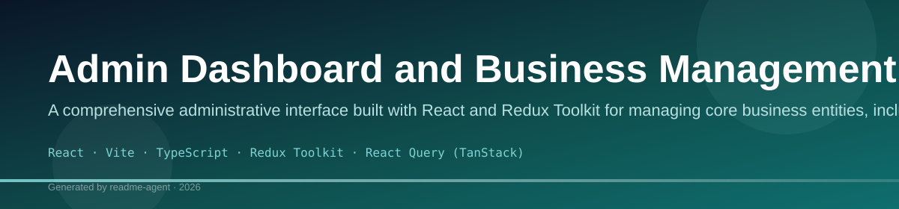
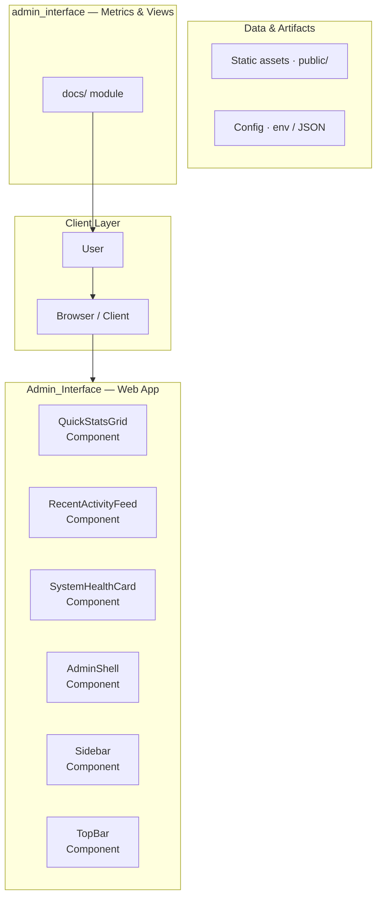
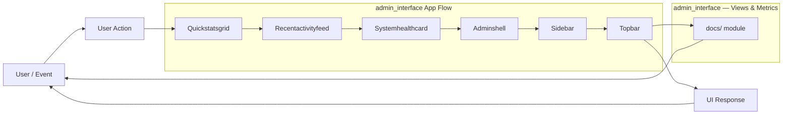
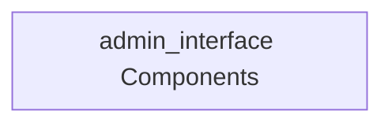
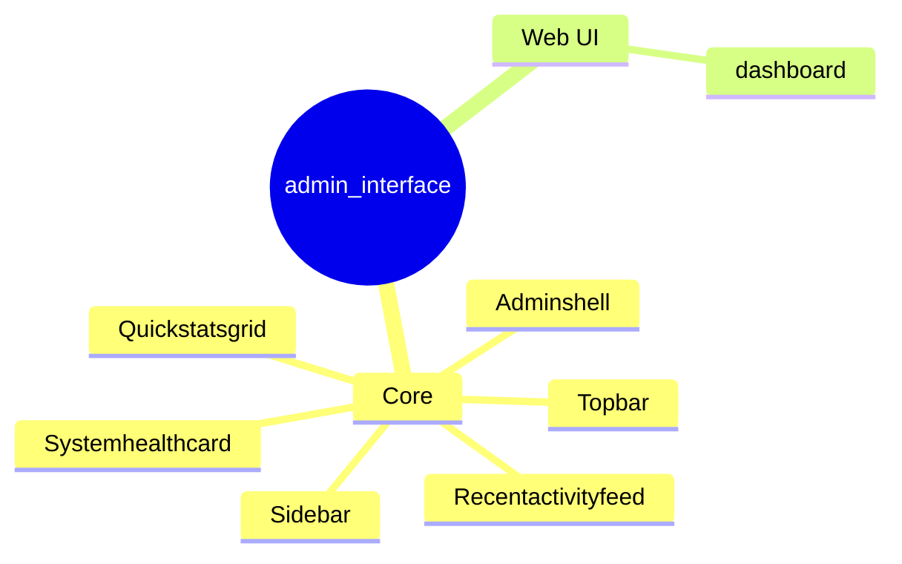
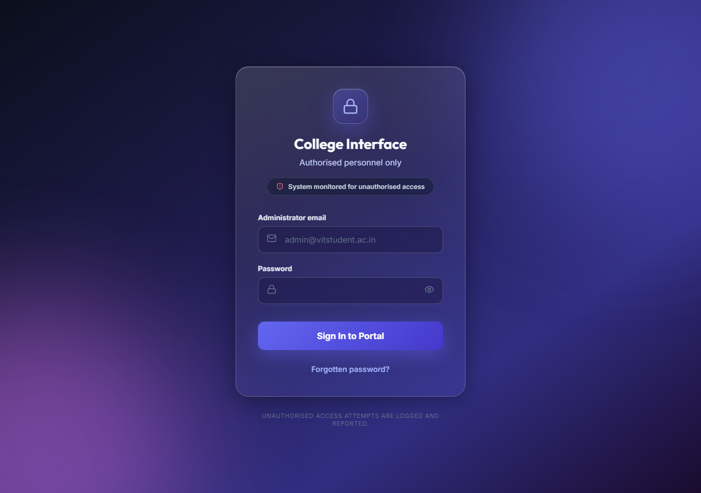
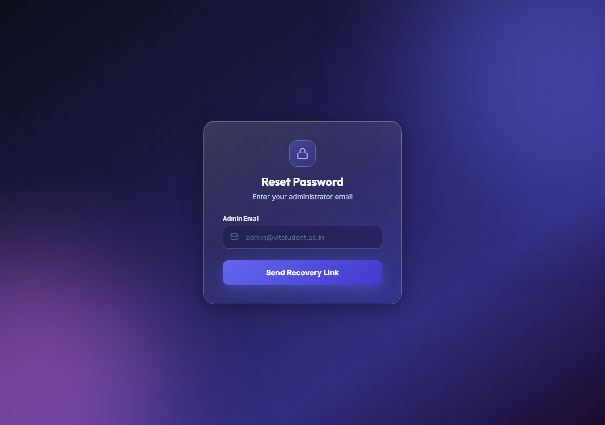
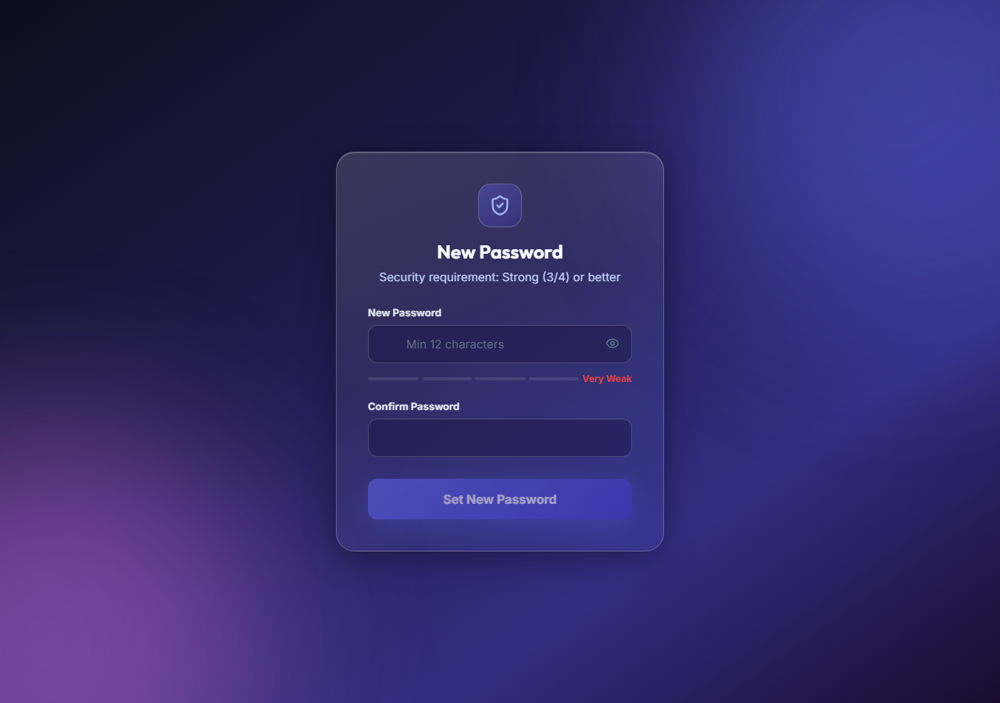

# Admin Dashboard and Business Management Portal

A comprehensive administrative interface built with React and Redux Toolkit for managing core business entities, including orders, vendors, locations, and analytics.

## Overview

This project is a sophisticated Single Page Application (SPA) designed to serve as a centralized administrative dashboard. It provides authenticated access to manage critical business data and view performance analytics. The application utilizes a modern, component-driven architecture, relying on Supabase for backend services, authentication, and data persistence. The core functionality revolves around CRUD operations for various entities (Vendors, Categories, Locations) and tracking business transactions (Orders).

## Key Features

- User Authentication: Implements standard login, forgot password, and password reset flows.
- Dashboard Overview: Provides a summary view of key business metrics and analytics.
- Vendor Management: Allows for the creation, reading, updating, and deletion (CRUD) of vendor records.
- Category Management: Enables the administration of product or service categories.
- Location Management: Facilitates the management of physical or operational locations.
- Order Management: Tracks and manages detailed order records, likely linking to vendors and locations.
- Analytics Reporting: Displays visualized data (e.g., sales trends, performance metrics) using charting libraries.

## Technology Stack

- React
- Vite
- TypeScript
- Redux Toolkit
- React Query (TanStack)
- Supabase
- React Router DOM
- Recharts
- Axios

## 🚀 Project Overview

This repository contains the source code for a comprehensive, modern dashboard application built using React and Vite. It utilizes Tailwind CSS for styling, providing a clean, responsive, and highly customizable user interface. The application is designed to manage and display various types of metrics and data visualizations.

### ✨ Features

*   **Modern UI/UX:** Built with React and styled using Tailwind CSS for a professional, responsive look.
*   **Modular Architecture:** Components are separated into distinct modules (`src/components`) ensuring maintainability and reusability.
*   **Dashboard Focus:** Designed specifically for data visualization and quick metric display.
*   **State Management:** Implements robust state management patterns suitable for complex dashboard interactions.

## 🛠️ Tech Stack

*   **Frontend:** React
*   **Build Tool:** Vite
*   **Styling:** Tailwind CSS
*   **Language:** JavaScript/TypeScript (Implied)

## 📂 Project Structure

The project follows a standard, scalable React structure:

*   `src/components/`: Contains reusable, presentational components (e.g., `Sidebar`, `Card`, `QuickStatsGrid`).
*   `src/pages/`: Contains the main page layouts that assemble components (e.g., `DashboardPage`).
*   `src/assets/`: Holds static assets like images and icons.
*   `src/App.jsx`: The root component that renders the main application layout.

## 🧠 System Architecture Diagram

This diagram illustrates the high-level interaction between the core components and the data flow within the application.

## 🔄 Data Flow Diagram

This diagram maps the flow of data from the source through the state management layer to the final presentation components.

## 🧩 Component & API Mapping

This section maps reusable components to the data they consume and the state they modify. This ensures clear separation of concerns.

## 🗺️ Application Page Map

This mindmap outlines the primary views and the components they assemble.

## 🚀 Getting Started

### Installation

1.  **Clone the repository:**
    ```bash
    git clone <repository-url>
    cd <repository-name>
    ```
2.  **Install dependencies:**
    ```bash
    npm install
    # or
    yarn install
    ```

### Usage

To run the application locally:

```bash
npm run dev
# or
yarn dev
```

The application will typically be available at `http://localhost:5173` (or the port specified by Vite).

## 💡 Development Notes

*   **Styling:** All styling is managed via Tailwind CSS utility classes. Custom themes or color palettes should be configured in `tailwind.config.js`.
*   **State Management:** Use React Context or a dedicated state library (like Redux/Zustand, if implemented) for global state access. Components should consume state rather than managing it independently.
*   **Component Props:** Components are designed to be highly reusable. Always pass necessary data (props) explicitly rather than relying on global scope.

## Setup Guide

### Frontend Setup

```bash

npm install
npm run dev     # development
npm run build && npm start   # production
```

Open `http://127.0.0.1:5173` (or the port shown in the terminal).

### Configuration

Copy environment templates before running:

- `.env.example` → copy to `.env` in the same directory

### Running the Application

1. **Start web app** — `npm run dev` in `./`

```bash
cd .
npm install
npm run dev
```

## System Architecture

High-level system design, data flows, API map, and workflow pipelines derived from the repository structure.

### System Architecture



### Data Flow & Charts Pipeline



### Component & API Map



### Application Page Map



## Application Pages

Screenshots captured from the running application. Each page is listed with its function.

### Application

#### Analytics

Analytics — application page at `/analytics`



#### Categories

Categories — application page at `/categories`


#### Dashboard

Dashboard — application page at `/dashboard`


#### Forgot Password

Forgot Password — application page at `/forgot-password`



### Public

#### Login

Login — application page at `/login`


### Application

#### Orders

Orders — application page at `/orders`


#### Reset Password

Reset Password — application page at `/reset-password`



#### Vendors

Vendors — application page at `/vendors`


